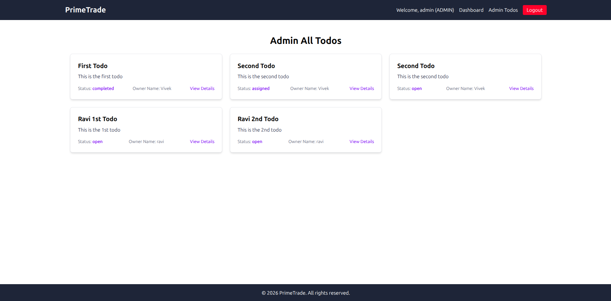
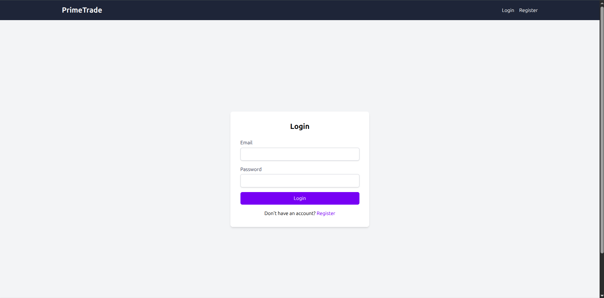
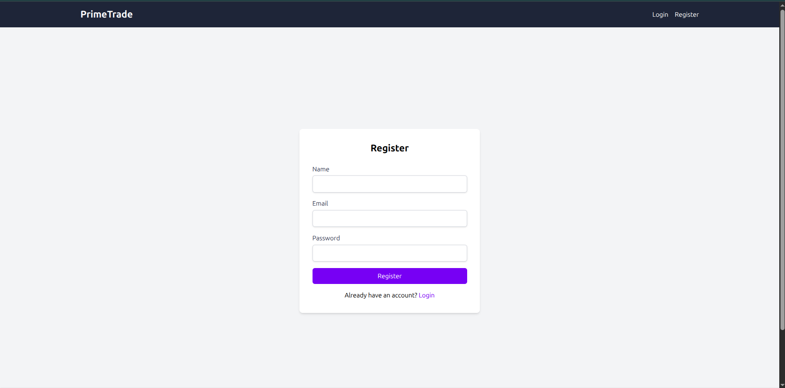
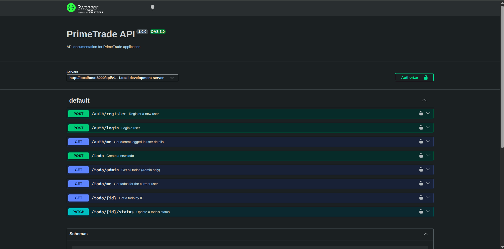
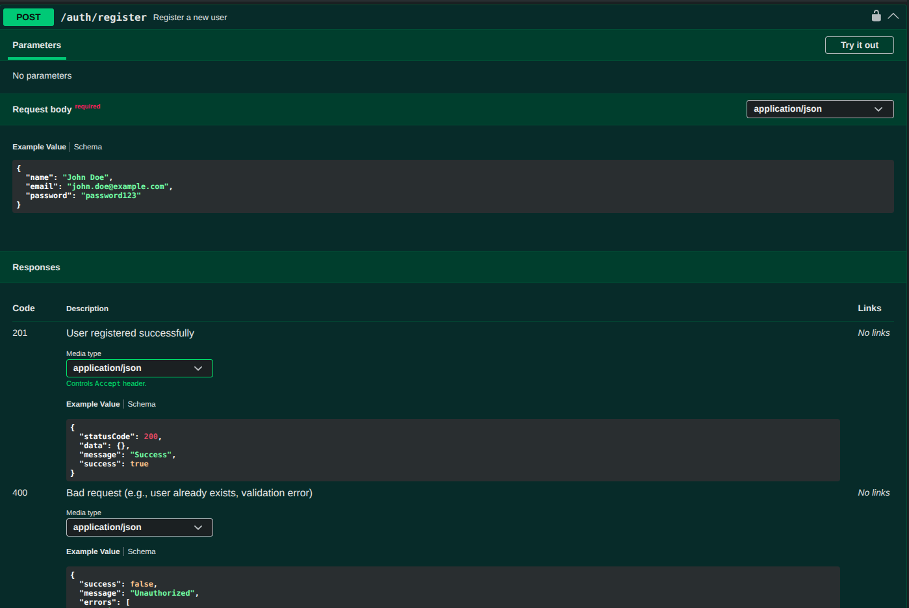

# PrimeTrade

## Table of Contents
- [Overview](#overview)
- [Quick Start](#quick-start)
- [Architecture Diagram](#architecture-diagram)
- [How to Run Full-Stack in Docker](#how-to-run-full-stack-in-docker)
- [API Documentation and Frontend Routes](#api-documentation-and-frontend-routes)
- [Deployment Notes](#deployment-notes)
- [Changelog](#changelog)
- [Frontend-Backend Mapping](#frontend-backend-mapping)

## Overview
PrimeTrade is a full-stack application designed for managing todos, featuring user authentication and administrative capabilities. The project consists of a React frontend and an Express.js backend, communicating via RESTful APIs.

## Quick Start
To get the entire PrimeTrade application (client and server) running concurrently, follow these steps.

1.  **Install Dependencies for Client and Server**:
    Navigate to the `client/` and `server/` directories respectively and install dependencies.
    ```bash
    # In /home/vivek/Project Practise/PrimeTrade/client/
    npm install
    # or yarn install

    # In /home/vivek/Project Practise/PrimeTrade/server/
    bun install
    # or npm install or yarn install
    ```
2.  **Environment Setup**:
    Create `.env.local` in `client/` with:
    ```
    VITE_SERVER_URL=http://localhost:8000/api/v1
    ```
    Create `.env` in `server/` with:
    ```
    PORT=8000
    MONGO_URI=mongodb://localhost:27017/primetrade
    JWT_SECRET=supersecretjwtkey
    JWT_EXPIRES_IN=7d
    CLIENT_URL=http://localhost:5173
    REDIS_URL=redis://localhost:6379
    ```
3.  **Start Both Development Servers**:
    You will need two separate terminal windows for this.

    ```bash
    # In Terminal 1 (client directory)
    cd client
    npm run dev

    # In Terminal 2 (server directory)
    cd server
    bun run dev
    ```
    Alternatively, if `concurrently` is installed globally or as a dev dependency at the root:
    ```bash
    # In the repository root
    npm install concurrently # if not already installed
    concurrently "npm run dev --prefix client" "bun run dev --prefix server"
    ```
    If `concurrently` is not available, here's a reliable 1-command Docker Compose snippet:
    ```yaml
    # docker-compose.yml (at the repository root)
    version: '3.8'
    services:
      mongodb:
        image: mongo:latest
        ports:
          - "27017:27017"
        volumes:
          - mongodb_data:/data/db

      redis:
        image: redis:latest
        ports:
          - "6379:6379"
        volumes:
          - redis_data:/data

      server:
        build: ./server
        ports:
          - "8000:8000"
        environment:
          MONGO_URI: mongodb://mongodb:27017/primetrade
          JWT_SECRET: supersecretjwtkey
          JWT_EXPIRES_IN: 7d
          CLIENT_URL: http://localhost:5173
          REDIS_URL: redis://redis:6379
        depends_on:
          - mongodb
          - redis

      client:
        build: ./client
        ports:
          - "5173:80"
        depends_on:
          - server
        environment:
          VITE_SERVER_URL: http://server:8000/api/v1

    volumes:
      mongodb_data:
      redis_data:
    ```
    To run this Docker Compose:
    ```bash
    docker-compose up --build
    ```

## Architecture Diagram (Textual)

```
+-------------------+       +-------------------+       +-------------------+
|                   |       |                   |       |                   |
|  Client (React)   |<----->|  Server (Express) |<----->|    MongoDB (DB)   |
|  (Port: 5173)     |       |  (Port: 8000)     |       |  (Port: 27017)    |
|                   |       |                   |       |                   |
+-------------------+       +--------^----------+       +-------------------+
                                     |
                                     v
                           +-------------------+
                           |                   |
                           |    Redis (Cache)  |
                           |  (Port: 6379)     |
                           |                   |
                           +-------------------+
```

## How to Run Full-Stack in Docker
To run both the client and server along with MongoDB and Redis using Docker Compose:

1.  **Create `docker-compose.yml`**: If you haven't already, create a `docker-compose.yml` file in the repository root with the content provided in the [Quick Start](#quick-start) section.
2.  **Build and Run**:
    ```bash
    docker-compose up --build
    ```
    This command will build the Docker images for the client and server (if they don't exist or have changed) and start all services.

## API Docs (Swagger & Postman)

This project provides API documentation through Swagger/OpenAPI for comprehensive API reference and Postman for convenient manual testing and exploration.

-   **Swagger UI**: Access the interactive API documentation at `http://localhost:8000/api-docs` (when the server is running locally) or `[YOUR_PRODUCTION_URL]/api-docs`.
-   **Swagger/OpenAPI Specification File**: The API specification is defined in `server/swagger.yaml`.
-   **Postman Collection**: No Postman collection file was found in the repository. A collection can be generated from the Swagger/OpenAPI specification (`server/swagger.yaml`).

**Recommended Workflow**:
-   Use Swagger UI as the primary **API reference** to understand endpoint details, request/response schemas, and authentication.
-   Use Postman for **manual API testing** and quick interaction with the backend, especially for chained requests (e.g., login then access protected resources).

| Tool      | Purpose             | Location           |
|-----------|---------------------|--------------------|
| Swagger   | API specification   | `server/swagger.yaml` |
| Postman   | API testing         | Not found         |

## Deployment Notes
Here are example steps for a production deployment:

1.  **Build Client**: Navigate to `client/` and run `npm run build`. This will generate static files in the `client/dist` directory.
2.  **Serve Client Static Files**: Configure a web server (e.g., Nginx, Apache) to serve the `client/dist` directory.
    Example Nginx configuration snippet:
    ```nginx
    server {
        listen 80;
        server_name yourdomain.com;

        location / {
            root /var/www/primetrade/client; # Path to your client's dist directory
            try_files $uri /index.html;
        }

        location /api/v1/ {
            proxy_pass http://localhost:8000; # Proxy to your backend server
            proxy_http_version 1.1;
            proxy_set_header Upgrade $http_upgrade;
            proxy_set_header Connection 'upgrade';
            proxy_set_header Host $host;
            proxy_cache_bypass $http_upgrade;
        }
    }
    ```
3.  **Deploy Backend**: Build the backend (`bun run build` in `server/`) and deploy it to a server. Ensure environment variables (`PORT`, `MONGO_URI`, `JWT_SECRET`, `JWT_EXPIRES_IN`, `CLIENT_URL`, `REDIS_URL`) are correctly set in the production environment.
4.  **Database and Redis**: Ensure MongoDB and Redis instances are running and accessible from the backend server.


## Preview Images









## Frontend-Backend Mapping
For a detailed mapping of backend endpoints to the frontend pages/components that consume them, please refer to `FRONTEND_BACKEND_MAPPING.md`.
